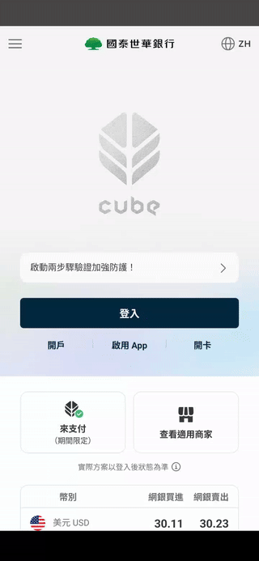

# Cube Banking App - Android Version  

click above pic to go to Google Play

&nbsp;

click below gif to watch demo on YouTube

)

  
   

# Yahoo Shopping App – Android Version

click above pic to go to Google Play

&nbsp;

click below gif to watch demo on YouTube

